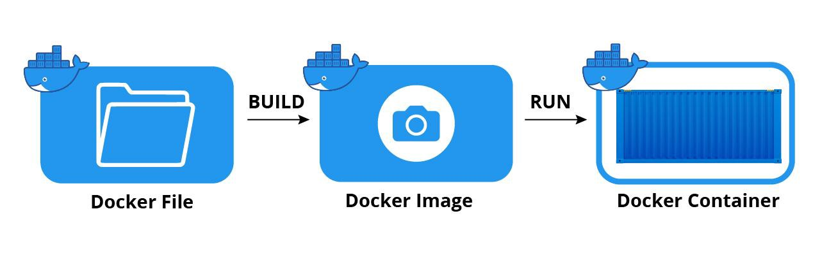

# Docker Introduction

The most important thing to use docker is Consistency, Docker provides a consistent environment across different development, testing, and production environments. Developers can build Docker images locally and be confident that they will run the same way in any environment where Docker is installed.




## Dockerfile

A **Dockerfile** is a text file that contains instructions to build a **Docker image**. 
- A Dockerfile is a text document that contains instructions for building a Docker image.
- It's essentially a recipe that specifies all the steps needed to create a Docker image.
- The Dockerfile typically starts with a base image (e.g., Ubuntu, Alpine Linux) and then specifies actions such as installing software, copying files, setting environment variables, and configuring the container.
- Dockerfile uses a simple, human-readable syntax to define these steps.


This example php version 8.2 fpm, in this Dockerfile contain
- Base Image
- Environtment Setup
- Copying application code and conf
- Exposing ports (Instructions to expose ports that the container will listen on at runtime. This allows communication between the container and the outside world)
- Running Command

Example :
```
FROM php:8.2-fpm

COPY php.ini /usr/local/etc/php/
COPY docker.conf /usr/local/etc/php-fpm.d/docker.conf
COPY .bashrc /root/

RUN apt-get update \
  && apt-get install -y build-essential zlib1g-dev default-mysql-client curl gnupg procps vim git unzip libzip-dev libpq-dev \
  && docker-php-ext-install zip pdo_mysql pdo_pgsql pgsql

RUN apt-get install -y libicu-dev \
&& docker-php-ext-configure intl \
&& docker-php-ext-install intl

# pcov
RUN pecl install pcov && docker-php-ext-enable pcov

# Xdebug
# RUN pecl install xdebug \
# && docker-php-ext-enable xdebug \
# && echo ";zend_extension=xdebug" > /usr/local/etc/php/conf.d/docker-php-ext-xdebug.ini

# Node.js, NPM, Yarn
RUN curl -sL https://deb.nodesource.com/setup_18.x | bash -
RUN apt-get install -y nodejs
RUN npm install npm@latest -g
RUN npm install yarn -g

# Composer
RUN php -r "copy('https://getcomposer.org/installer', 'composer-setup.php');"
RUN php composer-setup.php
RUN php -r "unlink('composer-setup.php');"
RUN mv composer.phar /usr/local/bin/composer

ENV COMPOSER_ALLOW_SUPERUSER 1
ENV COMPOSER_HOME /composer
ENV PATH $PATH:/composer/vendor/bin
RUN composer config --global process-timeout 3600
RUN composer global require "laravel/installer"

WORKDIR /root
RUN git clone https://github.com/seebi/dircolors-solarized

EXPOSE 5173
WORKDIR /var/www
```

## Docker Image

- A Docker image is a lightweight, standalone, executable package that includes everything needed to run a piece of software, including the code, runtime, libraries, and dependencies.
- It's built based on the instructions provided in the Dockerfile.
- Docker images are immutable, meaning once built, they cannot be changed. If you make changes, you need to rebuild the image.
- Images are stored in a Docker registry, such as Docker Hub or a private registry, and can be shared and reused across different environments.


## Docker Container

- A Docker container is a runtime instance of a Docker image.
It's a lightweight, isolated environment that runs the software packaged in the Docker image.
- Containers are ephemeral, meaning they can be started, stopped, moved, and deleted easily.
- Multiple containers can run concurrently on a single host, each isolated from the others.
- Containers encapsulate the application and its dependencies, making it easy to deploy and scale applications consistently across different environments.

## Summary
In summary, Dockerfile defines the build process for creating Docker images, Docker images are immutable snapshots of applications and their dependencies, and Docker containers are lightweight, portable, and runnable instances of Docker images. Together, these components enable developers to package, distribute, and run applications in a consistent and reproducible manner across different environments.

