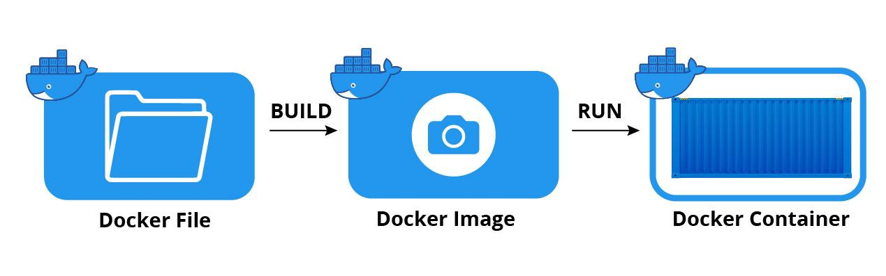

# Docker Laravel

The most important thing to use docker is Consistency, Docker provides a consistent environment across different development, testing, and production environments. Developers can build Docker images locally and be confident that they will run the same way in any environment where Docker is installed.




## Dockerfile
:::info

A **Dockerfile** is a text file that contains instructions to build a **Docker image**. 

:::

This example php version 8.2 fpm, in this Dockerfile contain
- Base Image
- Environtment Setup
- Copying application code and conf
- Exposing ports (Instructions to expose ports that the container will listen on at runtime. This allows communication between the container and the outside world)
- Running Command

Example :
```
FROM php:8.2-fpm

COPY php.ini /usr/local/etc/php/
COPY docker.conf /usr/local/etc/php-fpm.d/docker.conf
COPY .bashrc /root/

RUN apt-get update \
  && apt-get install -y build-essential zlib1g-dev default-mysql-client curl gnupg procps vim git unzip libzip-dev libpq-dev \
  && docker-php-ext-install zip pdo_mysql pdo_pgsql pgsql

RUN apt-get install -y libicu-dev \
&& docker-php-ext-configure intl \
&& docker-php-ext-install intl

# pcov
RUN pecl install pcov && docker-php-ext-enable pcov

# Xdebug
# RUN pecl install xdebug \
# && docker-php-ext-enable xdebug \
# && echo ";zend_extension=xdebug" > /usr/local/etc/php/conf.d/docker-php-ext-xdebug.ini

# Node.js, NPM, Yarn
RUN curl -sL https://deb.nodesource.com/setup_18.x | bash -
RUN apt-get install -y nodejs
RUN npm install npm@latest -g
RUN npm install yarn -g

# Composer
RUN php -r "copy('https://getcomposer.org/installer', 'composer-setup.php');"
RUN php composer-setup.php
RUN php -r "unlink('composer-setup.php');"
RUN mv composer.phar /usr/local/bin/composer

ENV COMPOSER_ALLOW_SUPERUSER 1
ENV COMPOSER_HOME /composer
ENV PATH $PATH:/composer/vendor/bin
RUN composer config --global process-timeout 3600
RUN composer global require "laravel/installer"

WORKDIR /root
RUN git clone https://github.com/seebi/dircolors-solarized

EXPOSE 5173
WORKDIR /var/www
```

## Docker Image

:::info

Images are read-only blueprints that include container-creation instructions. A Docker image is a container created to operate on the Docker framework. Consider an image a blueprint or picture of what will be in a container when it is operational.

:::


Example docker laravel use php, nginx and mysql

## Folder Structure
This is how i set folder

```
root project folder
├── .docker
│   ├── db
│   |── logs
|   |-- nginx
|   |__ php
|
├── src/
└── docker-compose.yml/
```


